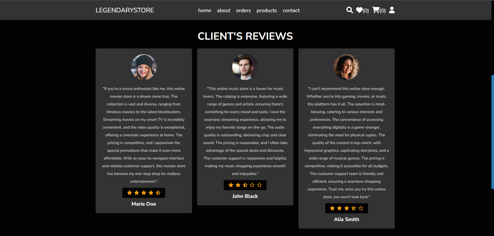

# LegendaryStore

This is a PHP-based online market place web application that runs locally using XAMPP and MySQL. The website demonstrates basic functionalities such as connecting to a MySQL database, performing CRUD operations, and displaying data on web pages.

## Snaps 📷





## Prerequisites

- [XAMPP](https://www.apachefriends.org/index.html) (Apache, MySQL, PHP)
- A web browser (e.g., Chrome, Firefox)

## Installation

1. **Download and Install XAMPP:**

   Download and install XAMPP from the [official website](https://www.apachefriends.org/index.html). Follow the installation instructions for your operating system.

2. **Clone the Repository:**

   Clone this repository to your local machine using Git
   
## Instructions 

- Clone the repository in htdocs folder("..\xampp\htdocs")
- Run Apache and SQL servers using the XAMPP Control Pannel
- Go to phpmyadmin(http://localhost/phpmyadmin/) and create the shop_db and run the shop_db query (copy or import from src\Readme\database\shopdb.sql)
- Configure Database Connection:

Open the components/config.php file in the root directory of the project and update the database connection settings:

php
```
<?php

$db_name = 'mysql:host=localhost;dbname=shop_db';
$user_name = 'root';
$user_password = '';

$conn = new PDO($db_name, $user_name, $user_password);

?>

// Check connection
if ($conn->connect_error) {
    die("Connection failed: " . $conn->connect_error);
}
?>
```
- Now view the site (http://localhost/LegendayStore/src)
  
- To access the admin dashboard navigate to http://localhost/LegendayStore/src/admin/dashboard manually and login with the default admin credentials(name : 'admin', password : '111').
